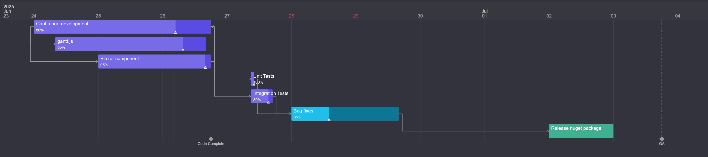

# MudGantt
Gantt chart for MudBlazor

## Interaction
- Drag tasks to move them
- Drag edges of tasks to change start/end dates
- Drag progress handle to change progress

# Usage

## App.razor
```csharp
<script src="_content/MudGantt/moment.min.js"></script>
```
Add dependeny to moment.js to your project. This is required for date handling.
```csharp

## Page.razor

```csharp

<MudGanttChart @bind-Tasks="@_tasks" Variant="MudVariant.Filled" Color="MudColor.Primary"/>

@code {

    private IReadOnlyList<MudGanttTask> _tasks = [
        new MudGanttTask
        {
            Id = "implementation",
            Name = "Implement stuff",
            StartDate = new DateTimeOffset(2026,6,24,0,0,0,TimeSpan.Zero),
            EndDate = new DateTimeOffset(2026,6,25,16,0,0,TimeSpan.Zero),
            Progress = 0.75
        },

        new MudGanttTask
        {
            Id = "unit-tests",
            Name = "Unit Tests",
            StartDate = new DateTimeOffset(2026,6,26,9,0,0,TimeSpan.Zero),
            EndDate = new DateTimeOffset(2026,6,26,17,0,0,TimeSpan.Zero),
            DependentOn = ["implementation"],
            Progress = 0
        }
    ];
}
```

# Samples


## Light Mode


## Dark mode


